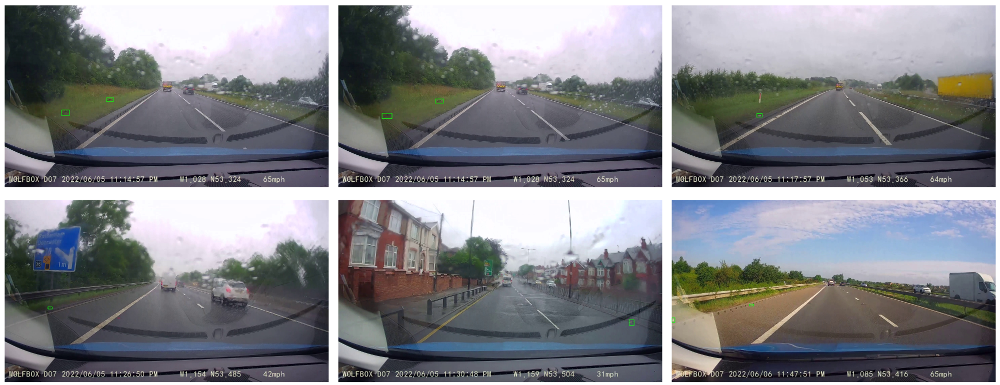

# WACVW 2026 | RoLID-11K: A Dashcam Dataset for Small-Object Roadside Litter Detection


:pushpin: The Dataset can be downloaded from 

[[`arXiv`]()] [[`BibTeX`]()]

[Tao Wu]()<sup>1,\*</sup> [Qing Xu](https://xq141839.github.io/my-portfolio/)<sup>1,\*</sup> [Xiangjian He](https://scholar.google.com/citations?user=BiBXGfIAAAAJ&hl=en&authuser=1)<sup>1,✉</sup> [Oakleigh Weekes]()<sup>2</sup> [James Brown]()<sup>2</sup> [Wenting Duan](https://scholar.google.com/citations?user=H9C0tX0AAAAJ&hl=en&authuser=1)<sup>2</sup>

<sup>1</sup>University of Nottingham Ningbo China &emsp; <sup>2</sup>Univeristy of Lincoln &emsp;

<div align="center">
    
</div>

## 📰News

**[2026.01.01]** The dataset has been released!

**[2025.12.24]** The article has been accepted by the WACV 2026 Workshop.

## 📜Citation
If you find this work helpful for your project, please consider citing the following paper:
```

```
